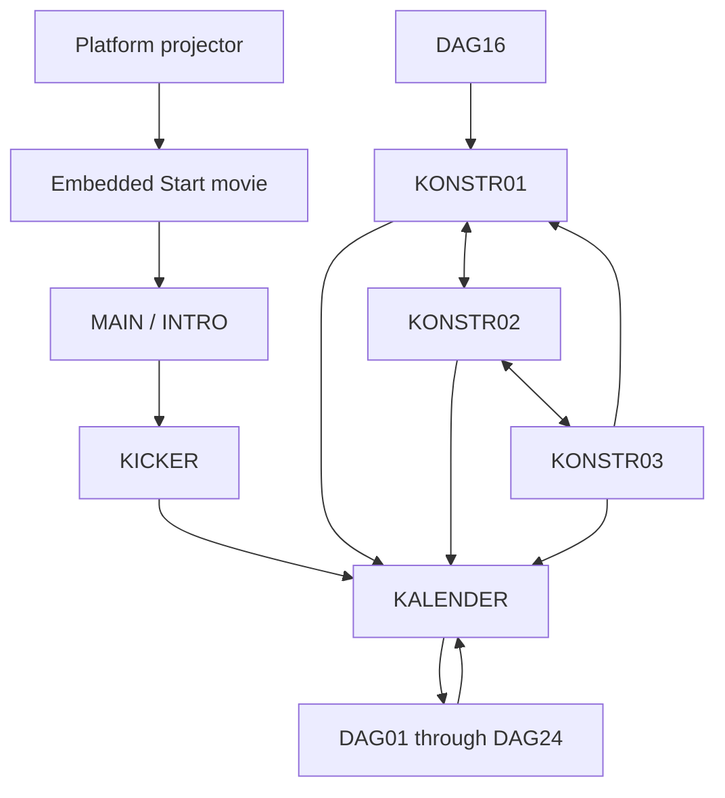

# Game architecture recovered from Lingo and Director data

This report describes the **game-specific implementation** recovered from the supplied disc. It is based on the decompiled `.ls` scripts, paired `.lasm` disassembly, and `MCsL`/`DRCF`/`CASt` resource manifests in `artifacts/decompiled`. Activity names below are descriptive labels inferred from code and asset names, not a claim to reproduce the original German menu wording. Static recovery is not equivalent to an end-to-end playthrough; the validation work at the end remains necessary.

## Overall design

Findus wartet auf Weihnachten is a **Macromedia Director 7 application whose game logic is Lingo**, with a 640×480 stage, numbered sprite channels, bitmap animation, sampled audio, and timeline frames/labels. It is an advent-calendar shell containing 24 day entries. Most entries contain an independent activity; day 16 opens three separate construction movies. Some entries are creative toys or narrated sequences rather than games with a win condition.

The system combines three execution styles:

1. **Director's score:** authored frame sequences, sprite properties, sound tracks, frame scripts, labels, transitions, and film loops.
2. **Lingo event handlers:** `exitFrame`, `mouseDown`, `mouseUp`, `keyDown`, `keyUp`, `beginSprite`, `idle`, and movie lifecycle handlers.
3. **Lingo-controlled simulation:** loops mutate sprites or custom script objects and explicitly call `updateStage()`, often using ticks/timers to advance animations.

Many activities deliberately remain on a score frame with `go(the frame)`. Porting the script text without recovering the score's channel assignments, script attachments, and label/frame relationships would omit part of the program.

The authoritative movie dimensions and stored frame rates are in each movie's `chunks/DRCF-*.json`. All 31 external movies inspected have a 640×480 stage. Their stored rates vary: 12–40 for many timeline activities, 120 for construction movies, and values of 500 or 999 in several custom-loop games. Treat these as stored Director settings requiring runtime interpretation; a browser must not advance all game physics once per display refresh.

## Startup and navigation

The graph's construction cycle represents the three selectable drawings, not a requirement to complete them sequentially.

- The embedded `Start` script and external `START.DXR` construct `moviePath + "main" + separator + "intro"`. The path separator is taken from the final character of `moviePath`.
- `INTRO` waits on sound channel 2 at one frame, moves to label `slut` when it ends, then enters `kicker`.
- `KICKER` establishes a search path ending in `main`, choosing a backslash when `machineType = 256` and a colon otherwise. It silences sound channel 2 and opens `KALENDER`.
- `KALENDER` records the selected filename in global `dag`, fades the music, unloads cast data, and calls `go(1, dag)`.
- Activities typically have an intro/rhyme, play/restart state, and a return-to-calendar state. Frequently used labels include `meny`, `start`, `spielen`, `bygg`, `vidare`, `spelslut`, and `slut`. Label spelling and meaning are local to each movie.
- `DAG16` resets `gkalenderintro` and immediately opens `KONSTR01`. Shared `PETTTALK` code chooses `KONSTR01`, `KONSTR02`, or `KONSTR03` using `AktRitning`, cycling 1–3.

Evidence: [embedded startup](<../artifacts/decompiled/projector/Start/casts/Internal/BehaviorScript 1 - go movie intro.ls>), [INTRO scripts](../artifacts/decompiled/INTRO/casts), [KICKER scripts](../artifacts/decompiled/KICKER/casts), [day 16 redirect](<../artifacts/decompiled/DAG16/casts/Internal/BehaviorScript 1 - go movie.ls>), [construction selection](<../artifacts/decompiled/PETTTALK/casts/External/MovieScript 8.ls>).

## Actual calendar/date rules

The active handler is `checkDate` in `KALENDER`, invoked when the calendar initializes. It reads structured `systemDate.month` and `systemDate.day` values:

| Local system month/day | `decDate` | Accessible day entries |
| --- | --- | --- |
| December 1–24 | Current day | Days 1 through the current day |
| December 25 onward | 25 | All 24 entries |
| September, October, November | 1 | Day 1 |
| January through August | 25 | All 24 entries |

No year condition is present. `decDate = 25` acts as an all-days value and is also used in calendar display/member selection; there is no `DAG25` file.

Each door has hardcoded screen bounds and a day filename. The first click opens the door animation. A second click enters the activity only if `guilty = 1`, which is set by `decDate > dayNumber - 1`. Moving to another door closes the previous one. A separate chest/list view uses the same date gate. Calendar access is based on the date, not on winning previous activities.

There is a keyboard Easter egg: accumulating the letters `tomte` toggles visibility of sprite 48. It does **not** modify `decDate`. The accumulator does not visibly reset on an incorrect prefix in this handler, so a faithful implementation should follow the recovered behavior rather than assuming a conventional cheat-code buffer.

The external `ROUTS` library also contains an older `kolladatum` function that parses localized month names and handles December 13–24 differently. No call to that function was found in the recovered named scripts. It is not the calendar's active policy and must not replace `checkDate` during a port.

Evidence: [active date calculation](<../artifacts/decompiled/KALENDER/casts/Internal/MovieScript 12.ls>), [calendar initialization](<../artifacts/decompiled/KALENDER/casts/Internal/BehaviorScript 39.ls>), [doors and Easter egg](<../artifacts/decompiled/KALENDER/casts/Internal/BehaviorScript 22.ls>), [chest/list selection](<../artifacts/decompiled/KALENDER/casts/Internal/BehaviorScript 7.ls>), [older date helper](<../artifacts/decompiled/ROUTS/casts/External/MovieScript 2.ls>).

## The 24 entries

The source column identifies the most useful starting points inside each recovered movie. Additional frame behaviors and the score remain part of each activity. Rates are the values stored in `DRCF`, not a measured playback rate.

| Day | Activity and recovered behavior | Important state / completion | Rate | Main source |
| --- | --- | --- | --- | --- |
| 01 | Floor-scrubbing race. A Findus object has acceleration, turning, fixed-point-like position/speed state, animation, and collision masks. Shift accelerates; Control reverses; left/right key codes turn. | Ordered checkpoint rectangles, lap counter, displayed elapsed time, bounce cooldown. Completes after the lap/checkpoint loop reaches its third-lap condition. | 25 | `BehaviorScript 3`; `MovieScript 1 - findus_script`; `MovieScript 4` in [DAG01](../artifacts/decompiled/DAG01/casts) |
| 02 | Lower a swinging fish into a frying pan with a fishing rod. Arrow keys alter rod pose and line length; a damped sine calculation produces the swing. | Pan and edge collision rectangles distinguish fish in pan, striking the side, landing on the table, and flying out of bounds. `resultat` selects success/failure feedback. | 29 | `scripts/MovieScript 2` in [DAG02](../artifacts/decompiled/DAG02/casts) |
| 03 | Sound-pair memory. Click one of 24 positions to hear its sound, then find the matching sound at another position. | A shuffled list holds 12 duplicated sound pairs; matching positions become zero. All 12 pairs cleared advances the score. | 15 | `MovieScript 30 - startfilmenscriptet`; `BehaviorScript 26 - vidklick` in [DAG03](../artifacts/decompiled/DAG03/casts) |
| 04 | Throw snowballs at chickens appearing in different positions; misses provoke egg-throw animations. | Difficulty changes the exposure interval. Seven hits advance `klubba` from 42 to 49 and win; seven misses/timeouts advance `tupp` from 35 to 42 and lose. | 40 | `MovieScript 13` (`honTest`); `BehaviorScript 32`; `MovieScript 34`/`48` in [DAG04](../artifacts/decompiled/DAG04/casts) |
| 05 | Hammer moving nails. Four script objects animate along lanes; the mouse hammer has a separate timed strike animation. | A nail needs three strikes. Hit testing uses explicit X/Y tolerances. `Poang` counts finished nails; the shared score/voice presentation feeds back performance and restarts. | 500 | `MovieScript 1 - INIT`; `MovieScript 7 - Mouse Stuff`; `ParentScript 3 - spik` in [DAG05](../artifacts/decompiled/DAG05/casts) |
| 06 | Snowboard course with steering, jumps, tricks, obstacles, and score. Left/right steer; down accelerates on the ground or grabs while airborne. | Distance `langd`, speed, jump/trick state, lives, and score fields. Falls penalize score/lives; reaching distance greater than 800 ends the run. | 30 | `BehaviorScript 4`; `MovieScript 78` (`playSnowboard`) in [DAG06](../artifacts/decompiled/DAG06/casts) |
| 07 | Nine-piece picture assembly. Pieces are randomized and dragged to their targets; picture variants are selected through `LinCast`/`LinusR`. | `klar`, active drag, piece/cast identity, snapping and locked placement. First-time instructions and later random variants differ. | 15 | `BehaviorScript 2`; `MovieScript 25` (`omstart`) in [DAG07](../artifacts/decompiled/DAG07/casts) |
| 08 | Search for dust creatures with a mouse-held spotlight. Three distinct creatures are selected from fixed possible locations; creature index 6 is excluded. | Spotlight state `flash`, capture timer, `HittadeMonster`, and reveal animation. Three captures complete the activity. A separate idle/release timer can end the attempt. | 500 | `MovieScript 6` (`FixaKagla`), `7`, `8`, `10`, `13`; `BehaviorScript 5 - HuvudLoop` in [DAG08](../artifacts/decompiled/DAG08/casts) |
| 09 | Assemble a tree from seven draggable pieces. The asset name `bygga_gran_8bit` supports the subject. | A shared drag mask intersects a target sprite; valid releases snap and lock the piece. `klar = 7` finishes. | 15 | `BehaviorScript 2`; `MovieScript 25` in [DAG09](../artifacts/decompiled/DAG09/casts) |
| 10 | Slingshot target game with characters called brothers in code. A mouse press launches one of two available projectiles along one of several predefined parabolic paths. | `gameObjectList`, `UNIObjectList`, up to four active brothers, position pools, score, and 120-unit game clock. Score weights depend on the target object. | 999 | `internal/MovieScript 6`, `7`, `10 - checkMouse`; `UNI` cast in [DAG10](../artifacts/decompiled/DAG10/casts) |
| 11 | Match presents/objects to spoken rhymes. Three objects and their matching rhymes are chosen, plus one distractor rhyme. | Randomized object/rhyme positions and drag targets. The selected cast scripts play the corresponding clue/response audio. | 15 | `MovieScript 25`; object-named `CastScript 40`–`48`; `BehaviorScript 19` in [DAG11](../artifacts/decompiled/DAG11/casts) |
| 12 | Baking activity with ingredient dragging, stirring and staged animations. | `gameStage`/`holdStage`, ingredient order, bowl collision rules, animation chains, and queued sound/object actions. Explicit `gameStage1` through `gameStage13` handlers drive the sequence. | 999 | `MovieScript 2 - initvar`, `19`, `20`, `14`–`35`; `UNIcode` cast in [DAG12](../artifacts/decompiled/DAG12/casts) |
| 13 | Two-sided visual memory with eight corresponding pairs. A first choice must come from the left group and the second from the other group. | Two shuffled sets; matching cast IDs differ by 20. Attempts, current pair, and eight-pair completion are tracked. | 15 | `MovieScript 5 - Memory scripts` in [DAG13](../artifacts/decompiled/DAG13/casts) |
| 14 | Construct/decorate a house scene from draggable architectural pieces: walls, roof, chimney, windows, and other elements. | Per-part target flags and completion counters; valid pieces snap into the scene. The exact visual theme should be confirmed against exported art. | 15 | `BehaviorScript 2`; `MovieScript 25`; architectural `CASt` names in [DAG14](../artifacts/decompiled/DAG14/casts) |
| 15 | Bounce Findus with a mouse-controlled paddle and collect objects. | Vertical acceleration, side-wall bounce, paddle-derived horizontal velocity, three lives, bird interference, and one collection per bounce. More than 11 collected objects advances to success. | 40 | `BehaviorScript 5`; `MovieScript 6`, `63` in [DAG15](../artifacts/decompiled/DAG15/casts) |
| 16 | Construction workshop, implemented by three other movies. Drag parts into a mechanism, then run its animation; Pettson presents the drawings. | `AktRitning`, `ObjektAktiv`, placement tolerance, dependencies between parts, and `KonstruktionFardig`. Three drawings can be selected. | 15 → 120 | [DAG16](../artifacts/decompiled/DAG16/casts), [KONSTR01](../artifacts/decompiled/KONSTR01/casts), [KONSTR02](../artifacts/decompiled/KONSTR02/casts), [KONSTR03](../artifacts/decompiled/KONSTR03/casts), [PETTTALK](../artifacts/decompiled/PETTTALK/casts) |
| 17 | Snowball game against an elk, with one- and two-player modes. Mouse moves Findus, click throws, and subsequent mouse movement curves the ball. | Projectile flight and splat state, elk AI or second-player keyboard movement, two score counters and game clock. Two-player elk input includes left/right or A/D key codes. | 999 | `MovieScript 3 - mainLoop`, `4 - initvar`, `5 - moveGravity`, `6 - moveElk`, `7 - poang` in [DAG17](../artifacts/decompiled/DAG17/casts) |
| 18 | Narrated Tomte sequence with page navigation and playback controls. | Six sections, each playing up to three `TOMTE_<section>_<part>` sounds; next/previous, stop/restart, and return-to-calendar actions. | 30 | `BehaviorScript 31`, `40`, page-navigation behaviors, `MovieScript 55` in [DAG18](../artifacts/decompiled/DAG18/casts) |
| 19 | Repeat a musical/bird sequence. Five cues are mapped to three clickable birds, with no consecutive duplicate bird. | Random sequence, user prefix, and mistake counter. Completing the five cues succeeds; three incorrect choices fail. | 15 | `BehaviorScript 1 - init`, `4 - click my birdie`; `MovieScript 11 - scripts` in [DAG19](../artifacts/decompiled/DAG19/casts) |
| 20 | Decorate Pettson's Christmas tree with draggable ornaments/objects. | Individual placement flags, cursor/drag state, depth changes, and reset positions. | 15 | `BehaviorScript 2`, `15 - locz`; `MovieScript 25` in [DAG20](../artifacts/decompiled/DAG20/casts) |
| 21 | Sliding-tile puzzle. The code supports board sizes 2–5 and initializes the main arrangement as 3×3. | Tile array, empty position, legal neighbor moves, shuffle by valid moves, timer, and ordered-tile completion. Score attachment must confirm which optional board-size controls are exposed. | 15 | `MovieScript 1 - massa_bra_handlers`; `BehaviorScript 13`–`16`, `21` in [DAG21](../artifacts/decompiled/DAG21/casts) |
| 22 | Color 13 ornaments using four paint selections and a brush cursor. | Changing an ornament swaps to its matching color-bank cast member. Coloring every item triggers praise; play can continue. | 15 | `BehaviorScript 171`–`176`; `MovieScript 177` in [DAG22](../artifacts/decompiled/DAG22/casts) |
| 23 | Dance around the tree, with a user-drawn route. Drag Findus to record a path and release to have five characters follow it. | Path ring buffer up to 10,000 points, followers spaced by ten samples, Y-based sprite depth sorting, and nine rotating sound clips. | 15 | `BehaviorScript 2`, `3`, `5`; `MovieScript 1`, `4 - actor_script`, `10 - checkSound` in [DAG23](../artifacts/decompiled/DAG23/casts) |
| 24 | Christmas finale with illustrated narration, a Tomte assembly/dressing interaction, and a wheel mechanism sequence. | `mode` switches narrative and Tomte states. Nine narration segments have timed picture cues; selected head/clothing/shoes/sound parts are tracked. Separate `HjulMaskin` scripts manage the wheels and machine. | 999 | `MovieScript 27 - hanteraavsnitt`, `33 - mainloop`, `46 - initber1`, `51 - checktomte`; `GrafikBer` and `HjulMaskin` casts in [DAG24](../artifacts/decompiled/DAG24/casts) |

## Cast libraries and code reuse

`MCsL` resources define both the cast-library order and external dependencies. Authoring paths often point to old Macintosh `...:Orginal:*.CST` files; the published disc supplies protected `.CXT` equivalents. A port should resolve these through its asset manifest rather than depending on those author-machine paths.

| Published cast | Referenced by | Recovered role |
| --- | --- | --- |
| `SHARED.CXT` | Calendar and day 4 | Shared UI/assets and score animation behavior. |
| `DAGAR.CXT` | Calendar | Day-number/door/calendar assets. The calendar's game scripts belong to its internal cast, not this external library. |
| `HONOR.CXT` | Day 4 | Chicken-game assets. Day 4's game scripts belong to its internal cast. |
| `JULAUDIO.CXT` | Days 5, 10, 12, 17 | Shared speech/effects used by several reused game systems. Some script-type members are empty; they must not be counted as recovered logic merely because they have names. |
| `ROUTS.CXT` | Days 5, 10, 12, 17 | Common score display, selected-player figure, sound/volume helpers, polygon hit testing, and legacy date/high-score helpers. |
| `PETTTALK.CXT` | Construction movies 1–3 | Pettson animation/dialogue, yes/no creatures, drawing selection, start/restart/calendar UI. |
| `SHARED16.CXT` | Construction movies 1–3, with cast alias `shared` | Treasure/map/FileIO routines retained in the library; present in the recovered program but active use is not established. |

Internal libraries also matter. Days 10 and 12 contain related `UNI`/`UNIcode` animation systems. They use script objects, lists of motion instructions, path points, frame ranges, chained follow-up actions, and sound triggers. These are game-authored reusable Lingo systems, not a second native game engine. Days 10 and 17 have an internal cast named `tyska kalendern` containing German-calendar integration behavior, evidence of adaptation of those activities into this shell.

The original ProjectorRays cast dumper incorrectly associated local resources with external cast entries that reused ID 1024. This project's extraction patch skips external `filePath` entries when assigning local resources. Use the regenerated manifests and directories. Resource-indexed `scripts-by-chunk/Lscr-*.ls` and paired disassembly remain the stable fallback when member names collide or a script has no cast member.

## State, persistence, and native interfaces

The source has broad movie/global state rather than one central game-state class:

- **Calendar:** `decDate`, `dag`, `spelDag`, `lucka`, `open`, `guilty`, and door position.
- **Activity session:** object lists, counters, temporary sprite identifiers, sound states, clocks, and puzzle arrangements. Repeated generic names such as `klar`, `ove`, `aktiv`, and `FirstTime` have activity-local meanings despite being declared global.
- **Shared UI:** `G_AktGame`, `G_AktSparaFigur`, score digits, selected-character displays, and first-time intro flags.
- **Construction:** `gkalenderintro`, `AktRitning`, part placement/animation arrays, `ObjektAktiv`, and `KonstruktionFardig`.

Do not replace all movie transitions with a complete global reset: cross-movie state such as construction selection and intro flags is intentionally shared. Conversely, keeping every stale per-game value indefinitely would also differ from the initialization and movie-unload behavior. Trace and document each retained field.

The only explicit `new(xtra(...))` calls found in the named Lingo sources are `new(xtra("fileio"))` inside `SHARED16`'s treasure helpers. They serialize four lines: gold feathers, gold money, treasure matrix, and map matrix. The path globals have no discovered setup in the main activity scripts, and no callers of those helpers were found outside that same library. Thus this is a **possible dormant dependency**, not evidence that the advent-calendar games need a filesystem save backend. Likewise, a `CheckHighScore` helper is present, but its presence alone does not establish active persistent scores.

The gameplay scripts rely directly on Director services for sprite compositing/hit testing, sound mixing, input, timers/date, cursor rendering, path/movie loading, and quitting. No `FSCommand`, `tellTarget`, `getURL`, or SWF-specific gameplay call was found in the named scripts. The global variable `flash` is used by day 8's spotlight and by UI click guards. It is not a Flash runtime reference. The packaged Flash Xtra is a separate native component; the recovered type-15 members are identified as rich-text Xtra members in the analysis inventory.

Evidence: [FileIO routines](<../artifacts/decompiled/SHARED16/casts/External/MovieScript 1 - FileIO.ls>), [high-score helper](<../artifacts/decompiled/ROUTS/casts/External/MovieScript 13.ls>), [spotlight state](<../artifacts/decompiled/DAG08/casts/Internal/MovieScript 6.ls>), [shared construction state](<../artifacts/decompiled/PETTTALK/casts/External/BehaviorScript 121 - start.ls>).

## Semantics a portable runtime must preserve

1. **Cast identity and lookup.** Preserve `(movie, cast library, member ID)` and names, plus the cast-library order. Numeric member references, qualified names, unqualified names, and packed values such as the calendar's `131131` cannot be treated as interchangeable array indices. Consecutive member IDs often encode animation or color banks.
2. **Score/script event ordering.** Recover frame scripts and sprite behaviors, score defaults versus `puppetSprite` overrides, movie/label changes, and whether a handler continues after `go`. Several scripts contain meaningful statements after a `go`, so blindly translating it into a function return changes behavior.
3. **Legacy numeric/list semantics.** Lingo lists are indexed from one. Integer division, float conversion, `mod`, string/number coercion, symbols, points/rectangles, list aliasing, and property-list sorting are used throughout. For example, sliding-puzzle row calculation and race time formatting depend on arithmetic semantics; `getAt`/`setAt` mutability is central to game state.
4. **Time.** Recover the distinction between score frame rate, `the ticks`, `the timer`/`startTimer`, and `the milliSeconds`. The code itself uses `/ 60` for seconds in several places. Some loops advance once per frame, others wait a number of ticks, and others accumulate real elapsed time. Implement waits cooperatively so the browser can render and receive input while preserving the intended event order.
5. **Visual geometry.** Preserve 640×480 logical coordinates, registration points, sprite width/height, mask behavior, palette/indexed-color interpretation, ink/blend modes, visibility, constraints, and `locZ`. Scale the whole logical viewport with matching inverse pointer mapping. Day 23's depth sorting and the construction games' registration-point adjustments are visible behavioral requirements.
6. **Collision and picking.** Do not assume every `sprite intersects sprite` is a plain bounding-box test. Several activities use explicit mask sprites, rectangle edges, or narrow tolerance windows. Match the Director behavior actually used by each cast type and ink mode.
7. **Input state.** Distinguish press, held state, release, rollover, and drag. Some loops wait for release; others require a newly pressed button. Map historical key codes to browser keys deliberately, including Shift/Control and day 17's second-player controls.
8. **Sound as control flow.** `soundBusy` frequently determines when a movie/frame advances. Preserve channel numbers, replacement/stopping semantics, volume changes, speech-skipping input, and actual durations. A muted channel can still be busy; silence must not imply completion.
9. **Randomness.** Preserve inclusive `random(n)` choices, rejection/shuffle behavior, and the order of random draws when building deterministic replay tests. Otherwise variants, scores, and animation timings diverge immediately.
10. **Text/encoding.** Keep raw script/resource bytes beside interpreted text. Swedish identifiers and filenames coexist with German content and old Macintosh authoring paths. Inspect encoding per resource; decoding everything as UTF-8 or silently replacing undecodable bytes destroys identifiers.

These are requirements inferred from concrete uses in the recovered game. A port can implement only the observed subset, but the subset must be enumerated from all reachable scripts and score/media resources rather than selected from the easiest activity.

## Recommended implementation boundary and validation

A practical web architecture is a loader/export manifest, a small Director-compatible stage/audio/input/time layer, per-movie score data, and recovered game behaviors expressed as explicit state machines. Native Windows/Mac projector code can be excluded from that runtime once its loading and service contracts are understood. Preserve original assets and stable IDs during the first faithful implementation; redesigning layouts or object identities at the same time makes comparison harder.

First establish an original-runtime reference session, then record deterministic input traces for:

- Startup through the calendar; calendar dates August 31, September 1, November 30, December 1/16/24/25, and January 1; opening a locked door versus entering an unlocked one; chest/list and Easter egg.
- Entry, intro skip, restart, exit, and at least one success/failure path for every day that has them. Include replay after visiting a different activity to catch global-state retention errors.
- Representative semantics: race collision and lap completion; fish edge hit; sound-memory pairing; all day-4 difficulties; multi-hit nails; snowboard fall/jump; puzzle snap/reject; day-8 capture and timer expiry; ingredient success/rejection; day-17 single/two-player behavior; narrated-page interruption; 13 colored ornaments; drawn dance path; all three construction drawings; finale's story and Tomte/machine states.

Compare stage images, channel audio events, movie/frame/label changes, and key game-state fields. Asset extraction coverage, Lingo recovery coverage, and successful runtime behavior are separate measurements. Native reccmp results, if later produced, are a fourth independent measurement; see [reccmp assessment](reccmp-assessment.md).

Authored score frames, spans, and behavior attachments are now exported in [the analysis directory](../artifacts/analysis). Their event timing, tweening, runtime mutations, any decompiler reconstruction errors, media-type edge cases, and full original-runtime behavior remain to be validated. See [recovery quality](recovery-quality.md) for bytecode coverage and encoding caveats. Use `scripts-by-chunk/Lscr-<resource-ID>` and the member bindings in the analysis manifests for automated processing; the named cast folders linked above are browsing conveniences and can contain colliding aliases. Recovered code supports the architecture and activity descriptions above; it does not justify claiming that a complete platform port has already been validated.
